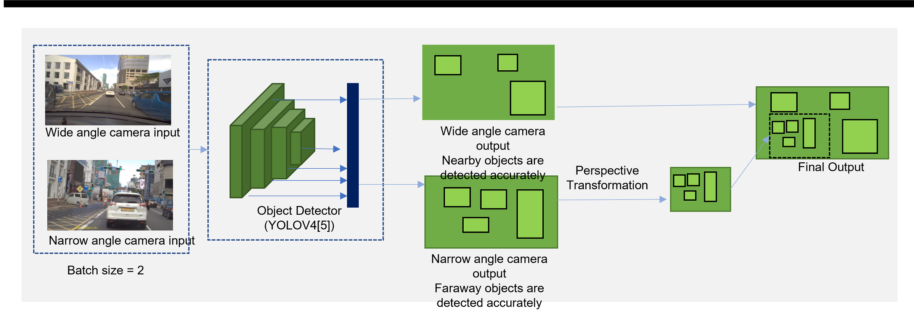

# Camera System

This repository includes all codes related to the camera system which consists of two Basler DaA1920-30uc cameras. 

(The repository is around 120MB due to deleted but still tracking .tar.gz files.)

    

## Python3 implementation
- [9_multi_camera_mlti_thread.py](camera_system\scripts\test_camera\9_multi_camera_mlti_thread.py)
- [11_single_camera_image_feeder.py](camera_system\scripts\test_camera\11_single_camera_image_feeder.py)

These python codes can be used for personal laptops preserving maximum speed (30fps) of cameras. But systems like Jetson AGX Xavier, this is not fast enough. (Maximum achievable speed is between 20-30fps). This code is tested on Windows 10 and Ubuntu 18.04. 

### Requirements
* Pylon APIs
* PyPylon python wrapper
* FFMPEG

## C++ implementation 
- [multi_camera_image_feeder.cpp](camera_system\src\multi_camera_image_feeder.cpp)
- [single_image_feeder.cpp](camera_system\src\single_image_feeder.cpp)

These codes are designed targetting Jetson AGX Xavier (Ubuntu 18.04) to achieve 30fps. (Cameras' maximum frame rate) This is not tested on Windows. 

### Requirements
* Pylon APIs

## Traffic light detection using Two Camera input

Object detection model: YOLOv4
(This is our initial method. Currently we are using YOLOv5 as designed in [ROS_system](https://github.com/entc17fyp6/ROS_system))

### Real time traffic light detection

### Combining two camera inputs

    

### System architecture

